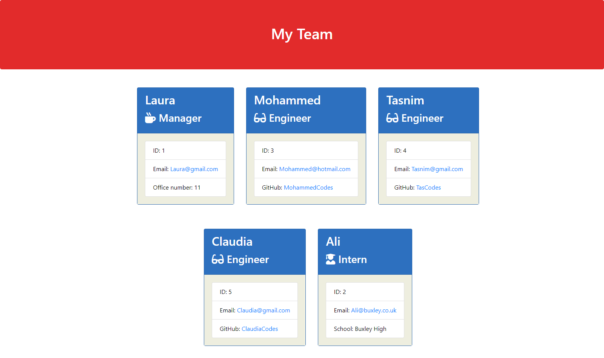

# Team Profile Generator

Welcome to the Team Profile Generator! This webpage showcases my skills utilising Node.js through generating team profiles for a company by prompting questions through Inquirer. You can access the live website [here.](https://github.com/hamdanurfore/team-profile-generator)

# Table of Contents

- [Introduction](#introduction)
- [Features](#features)
- [Getting Started](#getting-started)
- [Usage](#usage)
- [Technologies](#technologies)
- [Contributing](#contributing)
- [Acknowledgments](#acknowledgments)
- [License](#license)

# Introduction

The Team Profile Generator is a Node.js command-line application that helps users generate a simple team profile HTML page. It's designed to make it easy to create a well-organized summary of your team members, including managers, engineers, and interns. The generated HTML file includes individual cards for each team member, displaying relevant information such as their name, role, ID, email, and additional details specific to their role.


# Features

- User-friendly Interface: The application provides a command-line interface that guides the user through the process of inputting information for each team member.
- Dynamic HTML Generation: The application dynamically generates an HTML file based on the user's input, creating a visually appealing and organized team profile.
- Multiple Roles: Supports various roles including Managers, Engineers, and Interns, each with role-specific details.


# Getting Started

To get a copy of this project up and running on your local machine, follow these steps:

Clone this repository to your local machine using git clone:

```
git clone https://github.com/hamdanurfore/team-profile-generator.git 
```

Navigate to the project directory:

```
cd team-profile-generator
```

Install the required dependencies:

```
npm install
```




# Usage

Run the application by executing the following command in your terminal:

```
node index.js
```
Follow the prompts to input information for each team member.

Once all team members are added, select the option to finish and generate the HTML file.

Find the generated HTML file in the `output` directory.


# Technologies

- Node.js
- Inquirer.js
- Jest (for testing)


# Contributing

I welcome contributions and feedback! If you have suggestions for improvements, bug reports, or would like to collaborate on a project, please open an issue or submit a pull request.


# Acknowledgments

- Inquirer.js
- Bootstrap
- Font Awesome


# License

This project is licensed under the MIT License.